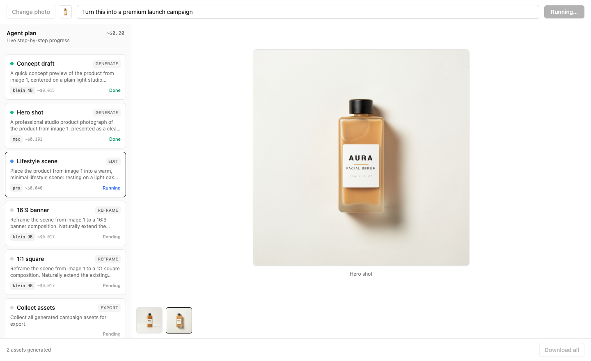
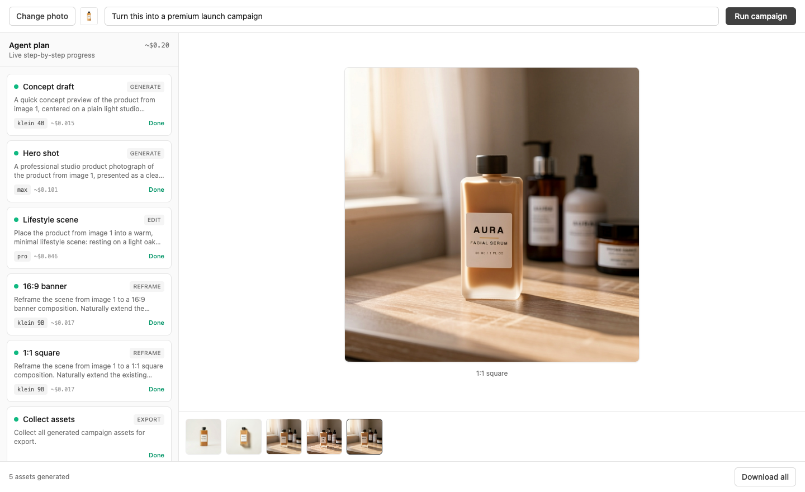

# FLUX Campaign Studio

An **agentic product-to-campaign studio** built on the [FLUX.2](https://bfl.ai) API.
Upload a product photo, type a plain-English goal, and watch an **agent** plan and
execute a sequence of FLUX.2 calls — generate a hero shot, place it in a lifestyle
scene, re-frame it into multiple aspect ratios, evaluate each result and retry if
needed — with every step of its plan rendering **live on an interactive canvas**.

The point of this repo is to be a **forkable, end-to-end reference application**: a
developer can run it against the real FLUX API in ~15 minutes and learn the patterns
that actually matter — async polling, a CORS-defeating backend proxy, cost-aware
model selection, and streaming an agent's progress to a UI.



Above: the agent mid-run — concept draft (klein 4B) and hero (max) done, lifestyle
(pro) running, reframes queued, with per-step model + cost and a live total. Below:
the finished campaign — five assets generated from one plain product image.



---

## How it works (two hard truths)

**1. FLUX generation is asynchronous.** Every image is: `POST` to a model endpoint →
receive a `polling_url` → `GET` it every ~0.5s until `status: "Ready"` → download the
result immediately (**the result URL expires in ~10 minutes**). There is no
synchronous "give me an image" call. The step-by-step progress UI is an honest
reflection of this polling loop.

**2. FLUX delivery URLs do not support CORS.** The browser cannot call the FLUX API
or fetch result images directly, so **a backend proxy is mandatory**. The frontend
talks only to our own backend; the backend holds the API key and talks to FLUX. It
also downloads and persists every result the moment it's ready, defeating both CORS
and the 10-minute expiry in one place.

### Architecture

```
 Browser (React)                 Our backend (Express)              FLUX.2 API
 ───────────────                 ─────────────────────              ──────────
 GoalInput ── POST /api/upload ─▶ store product image
 Run ─────── POST /api/run ─────▶ planner builds a CampaignPlan
                                  executor runs each step:
 PlanPanel ◀ GET /api/run/:id ── │   submitGeneration ───────────▶ POST /flux-2-*
   (SSE stream, live)     /stream │   pollUntilReady  ────────────▶ GET  polling_url
 Canvas   ◀ /api/uploads/<id> ─── │   download + persist ─────────▶ GET  result.sample
 ExportBar ─ download assets      │                                 (URL expires 10m)
```

- **`client/`** — React + TypeScript + Vite + Tailwind. Talks only to `/api/*`.
- **`server/`** — Node + Express (TypeScript, ESM). Holds the key; the only thing
  that talks to FLUX. The agent (planner + executor) lives here.
- **`shared/types.ts`** — TypeScript types imported by both sides.

Progress streams from server to client over **Server-Sent Events** (`GET
/api/run/:id/stream`) — simpler than websockets for one-directional updates.

---

## Setup (≤ 5 steps)

**Prerequisites:** Node 20+ and npm.

1. **Clone**
   ```bash
   git clone https://github.com/Mariaareadne1/flux-campaign-studio.git
   cd flux-campaign-studio
   ```
2. **Install** (one command installs both workspaces)
   ```bash
   npm install
   ```
3. **Add your API key.** Copy the example env file:
   ```bash
   cp .env.example .env
   ```
   Then edit `.env` and set `BFL_API_KEY` to a key from
   <https://dashboard.bfl.ai/get-started>. `.env` is git-ignored — never commit it.
   ```
   BFL_API_KEY=bfl_your_key_here
   PORT=8787
   ```
4. **Run both server and client**
   ```bash
   npm run dev
   ```
   Backend → <http://localhost:8787>, Frontend → <http://localhost:5173>.
5. **Try it.** Open the frontend, upload a product photo, pick **Launch** or
   **Social pack**, type a goal (e.g. _"turn this into a premium launch campaign"_),
   and click **Run campaign**. Watch the agent work, then **Download all**.

---

## Campaign types

| Type | Steps | Models | What it makes |
| --- | --- | --- | --- |
| **Launch** | concept → hero → lifestyle → reframe ×N → export | klein 4B, max, pro, klein 9B | A hero shot, a lifestyle scene, and reframes for each detected format |
| **Social pack** | hero → square + story + banner (with typography) → export | max, flex ×3 | On-image-headline social graphics in 1:1, 9:16, and 16:9 |

The planner reads the goal for hints: aspect-ratio words (`square`, `story`,
`16:9`…) pick formats, style words (`premium`, `minimal`…) shape the prompts, an
explicit `#RRGGBB` becomes a brand accent, and quoted text (e.g. `headline "Glow
Daily"`) becomes the social-pack headline.

### Adding a new campaign type

The planner is plain, inspectable data — adding a workflow is one function:

1. Write a `planYourType(goal, uploadedImageId)` builder in
   `server/src/agent/planner.ts` that returns a `CampaignPlan` (an ordered list of
   `PlanStep`s). Reuse the prompt templates in `server/src/agent/prompts.ts` or add
   new ones following the `flux-best-practices` skill.
2. Add your type to `CampaignType` in `shared/types.ts` and route to it in
   `planCampaign()`.
3. (Optional) add it to the selector in `client/src/components/GoalInput.tsx`.

The executor, SSE streaming, cost display, canvas, and export all work unchanged —
they operate on the generic `CampaignPlan` / `PlanStep` shape.

---

## Configuration

Everything a forker is likely to tune lives in **`server/src/config.ts`**:

- **`models`** — which FLUX model each step role uses (cost-aware tiering).
- **`sizes`** — default output dimensions (keep width/height multiples of 16).
- **`retry`** — bounded retry count and backoff.
- **`timeouts`** — polling cadence and per-request network timeouts.

---

## Cost notes

FLUX.2 uses **megapixel-based pricing**, and **editing (image-to-image) costs more
than text-to-image** because the input image is billed too. This app is almost
entirely I2I (each step edits an image), so the per-step cost shown in the UI uses
the I2I formula. Approximate I2I cost per ~1 MP image:

| Model | ~$/image (I2I) | Used for |
| --- | --- | --- |
| klein 4B | $0.015 | concept draft |
| klein 9B | $0.017 | reframes |
| pro | $0.045 | lifestyle |
| flex | $0.10 | social typography |
| max | $0.10 | hero shot |

A **Launch** campaign runs ~**$0.20**; a **Social pack** ~**$0.42**. Each StepCard
shows its model and estimated cost, and the plan header shows the running total.
See the [BFL pricing calculator](https://bfl.ai/pricing) for exact numbers.

---

## Gotchas worth knowing (and where they're handled)

- **Result URLs expire in ~10 minutes.** The executor downloads and persists every
  result immediately (`server/src/agent/executor.ts` → `server/src/storage.ts`), so
  the canvas and export never depend on a live FLUX URL.
- **No CORS on FLUX URLs.** `GET /api/image` (`server/src/routes/image.ts`) proxies
  any raw FLUX URL; result images are additionally persisted under
  `/api/uploads/...`.
- **FLUX can't reach `localhost`.** Input images are passed to FLUX as **base64**,
  not as our local URLs (`server/src/storage.ts` → `readAsDataUrl`).
- **Dimensions must be multiples of 16**; total pixels ≤ 4 MP.
- **Polling statuses** are `Pending` / `Ready` / `Error` (some responses also use
  `Failed`); anything that isn't `Pending`/`Ready` is treated as a terminal failure
  (`server/src/flux/client.ts`).
- **Rate limits (429)** carry a `Retry-After`; the executor honors it with backoff.

## API routes (backend)

| Route | Purpose |
| --- | --- |
| `POST /api/upload` | Store a product image; returns `{ id, url }` |
| `POST /api/run` | Start a campaign; returns the initial `Job` |
| `GET /api/run/:id` | One-shot job snapshot |
| `GET /api/run/:id/stream` | **SSE** live progress until terminal |
| `POST /api/generate` | Low-level: submit a FLUX generation |
| `GET /api/status?pollingUrl=…` | Low-level: poll once |
| `GET /api/image?url=…` | Proxy-download a raw FLUX result URL |
| `GET /api/uploads/:id` | Serve a stored image |

## Scripts

| Command | What it does |
| --- | --- |
| `npm run dev` | Run server + client together (hot reload) |
| `npm run dev:server` / `dev:client` | Run one side |
| `npm run build` | Typecheck the server and build the client |

## Project structure

```
flux-campaign-studio/
├── shared/types.ts          # types shared by client + server
├── server/src/
│   ├── index.ts             # Express app entry
│   ├── config.ts            # ← tune models, sizes, retry, timeouts here
│   ├── routes/              # generate, status, image, upload, run (SSE)
│   ├── flux/                # client (submit+poll), models (registry+pricing), errors
│   ├── agent/               # planner, executor (eval+retry), prompts
│   └── storage.ts           # persist uploads + results (base64 for FLUX)
└── client/src/
    ├── components/          # GoalInput, PlanPanel, StepCard, Canvas, ExportBar
    ├── state/store.tsx      # app state
    └── api/client.ts        # talks to our backend (incl. SSE)
```

---

Built with the FLUX.2 API. Prompting and API patterns follow Black Forest Labs'
`bfl-api` and `flux-best-practices` skills.
